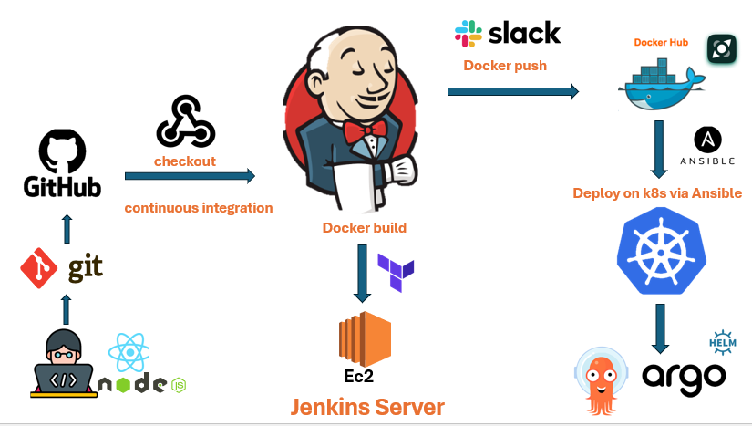

# Frontend and Backend Project

## Tools


## Overview
This project is a full-stack application that integrates frontend and backend components using various DevOps tools and best practices for deployment, orchestration, and automation. The goal is to streamline development and operations while leveraging cloud services for scalability.

## Tools & Technologies
The following tools are used to manage, deploy, and monitor this project:

- **Docker**: Containerization of applications for consistent and reproducible environments.
- **Jenkins**: CI/CD pipeline automation to build, test, and deploy the project.
- **Ansible**: Configuration management and automation to provision infrastructure and manage application settings.
- **Terraform**: Infrastructure as Code (IaC) for provisioning and managing cloud resources on AWS.
- **Kubernetes**: Orchestration of Docker containers for scalable application deployment and management.
- **AWS**: Cloud infrastructure provider, hosting the application and related services.
- **Slack**: Integrated notifications for monitoring and alerts during the CI/CD process and infrastructure changes.

## Project Structure
- **Frontend**: The UI part of the application built using modern web technologies.
- **Backend**: The API and business logic layers, handling data storage, retrieval, and user authentication.

## Infrastructure
1. **Docker** is used to containerize both frontend and backend applications for easier environment consistency.
2. **Terraform** provisions necessary AWS resources such as EC2 instances, S3 buckets, and more.
3. **Ansible** is used to configure servers and deploy the necessary software on them.
4. **Kubernetes** manages the Docker containers, ensuring scalability and resilience across multiple nodes.

## CI/CD Pipeline
1. **Jenkins** is used to automate the build, test, and deployment stages for both frontend and backend applications.
2. **Docker** images are built and pushed to the appropriate Docker registry.
3. **Ansible** and **Terraform** are triggered for configuration and infrastructure management.
4. **Slack** notifications are integrated into the pipeline to alert the team about build statuses, deployment success, or failures.

## Deployment Process
1. Clone the repository:
   ```bash
   git clone https://github.com/youssefmoghazy/final-project-DevOps-DEPI.git
